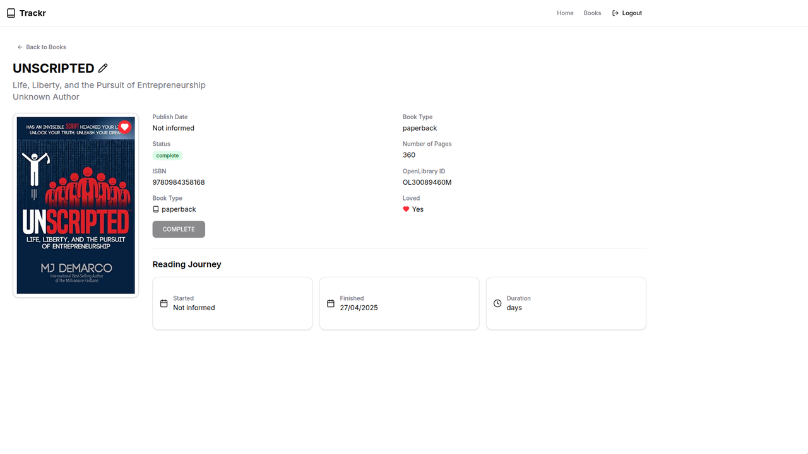
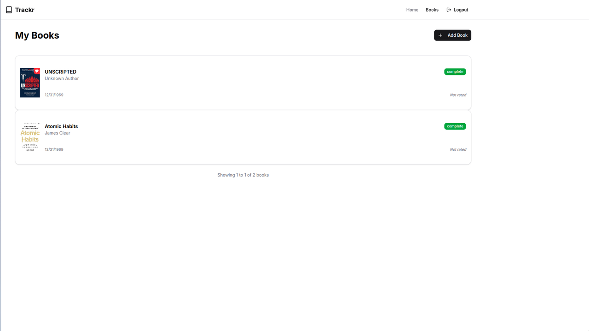
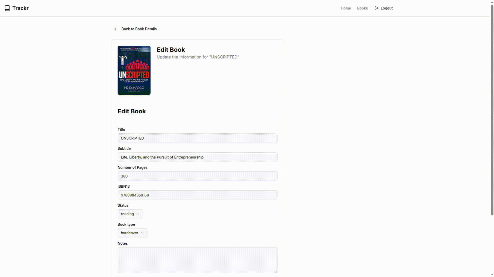

# 📚 Trackr

Trackr is a fullstack web application designed to help users keep track of the books they're reading, plan to read, have completed, paused, or dropped. This project was built to demonstrate robust back-end development with Java and Spring Boot, along with a responsive and modern front-end built with Next.js.

## 🔧 Tech Stack Overview

### 🖥️ Front-End
- **Next.js (React)**
- Tailwind CSS
- Shadcn/ui

### 🔗 Back-End
- **Java 17 + Spring Boot**
- PostgreSQL
- JWT Authentication
- JPA (Hibernate)
- Bean Validation
- Integration with **[Open Library API](https://openlibrary.org)**

👉 **Back-end has its own README**:  
[📁 View Backend README](./api/README.md)

---

## 📦 Dockerized Setup

To run the full application with Docker:

```bash
docker compose up --build
```

## 📸 Feature Walkthroughs (Videos)

- 📝 Adding a Book


- 📖 Book Details Page


- 📚 Books List Page


- ✍️ Book Edit Page


## 📬 Contact

Have questions or want to discuss the code?

- 📧 [Email](mailto:lucasmartvieira03@outlook.com)
- 💼 [LinkedIn](https://www.linkedin.com/in/lucas-martins-vieira/)
- 🐙 [Github](https://www.github.com/LucasMartinsVieira)
